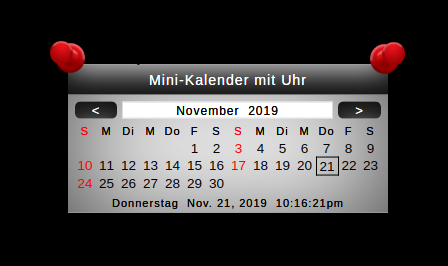
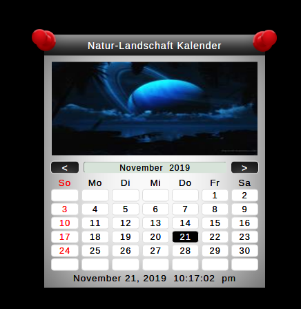

## MMM-NatureCalendar

* Simple calendar
* Optional Rotating Nature Scenes
* Optional color schemes
* 17 different languages

## Examples

  

## Installation

* `git clone https://github.com/mykle1/MMM-NatureCalendar` into the `~/MagicMirror/modules` directory.

## Config.js entry and options

```
    {
      disabled: false,
    module: "MMM-NatureCalendar",
    position: "middle_center",
    config: {
      calendarType: "today", // today, month and monthPlus
      lang: "all", // See language chart below. "all" for English.
      color: "gray0", // see color codes below
    }
  },
```

No language option for calendarType: "today"


## Language codes for config
* ar = Arabic
* zh_cn = Chinese (Simplified)
* zh_tw = Chinese (Traditional)
* nl = Dutch
* all = English
* fr = French
* de = German
* el = Greek
* id = Indonesian
* it = Italian
* ja = Japanese
* ko = Korean
* pt = Portuguese
* sv = Swediah
* ru = Russian
* es = Spanish
* th = Thai

## Color codes for config
* aqua0 = Aqua
* dblue0 = Blue #1
* eblue0 = Blue #2
* blk0 = Gray (Dark)
* nb0 = Gray (Light)
* green0 = Green
* purple0 = Purple
* dred0 = Red
* gold0 = Yellow

## Thanks go to @sdetweil for his z-index magic
