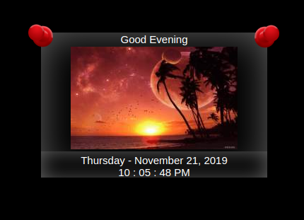

## MMM-NatureCalendar

* Simple calendar
* Optional Rotating Nature Scenes
* Optional color schemes
* 17 different languages

## Examples

* TBA

* TBA



## Installation

* `git clone https://github.com/mykle1/MMM-NatureCalendar` into the `~/MagicMirror/modules` directory.

## Config.js entry and options

```
    {
      disabled: false,
    module: "MMM-NatureCalendar",
    position: "middle_center",
    config: {
      calendarType: "day", // day, month and monthly
      lang: "all", // "all" for English
      color: "gray0",
    }
  },
```

